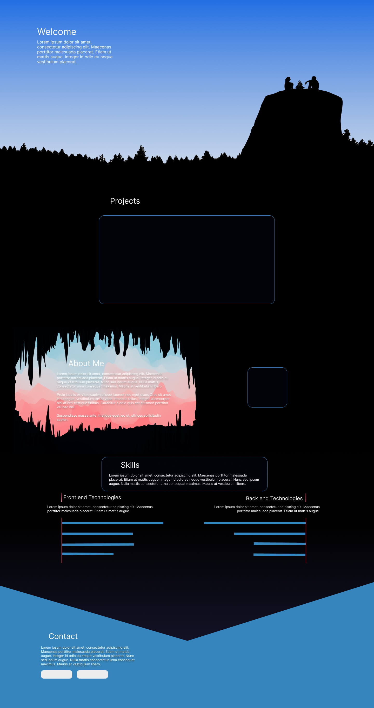

# My Portfolio Website

Take a look at the live website [suzannezomer.com](https://www.suzannezomer.com) (hosted on firebase).

When viewing on desktop, the user can navigate to each section either with a scroll up/down, keys up/down, or the side bar navigation.

## 1. Technologies

The website consists of a front-end only, and is created with plain HTML, vanilla JavaScript, and CSS. The images/videos are royalty free and modified/editted to fit the website.

The tools/libraries used:

- jQuery
- SCSS syntax
- Bootstrap 5

## 2. Theme Option

A theme button in the top right corner to switch between light and dark theme, which changes everything from the text color to the background images.

     
    <i>Preview of dark theme</i>

 

     
    <i>Preview of light theme</i>

## 3. The Design

The design for the webpage comes from my love for camping and hiking. The light & dark theme represents day and night. My goal is to portray this style while maintaining a functional and readable site.

     
    <i>The initial design of the website</i>

 

## 4. Mobile Friendly

The responsive layout can be viewed from different screen sizes.

     
    <i>Responsive implementation - Mobile user (Pixel 5)</i>

